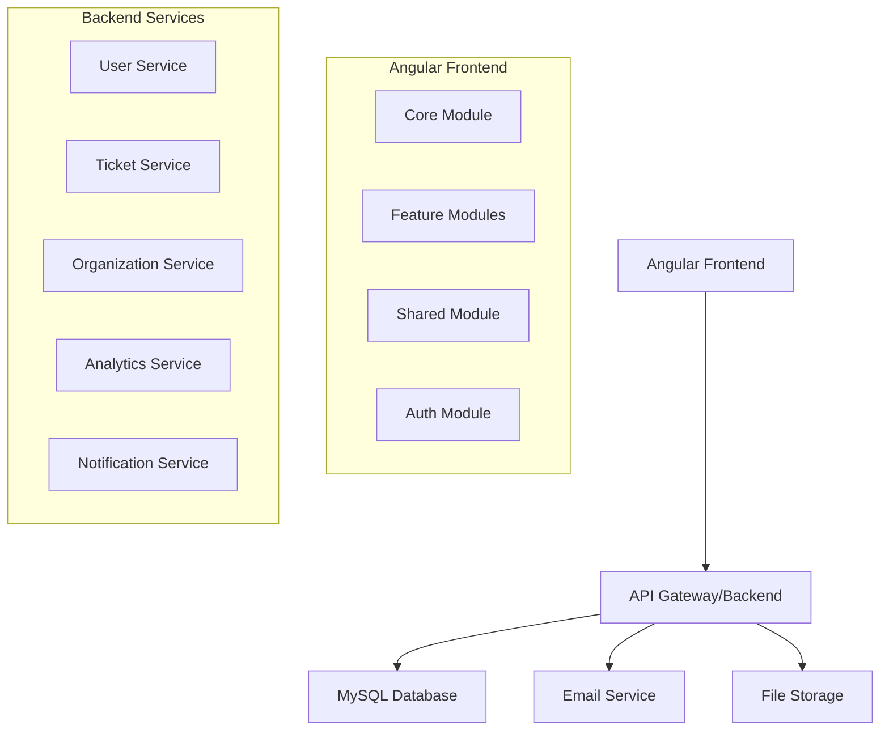

# Enterprise Ticketing System Design Document

## Overview

The Enterprise Ticketing System for "The President's Award - Kenya" is built using Angular 17+ with a modern, clean UI design featuring blue/purple branding. The system prioritizes user experience with a public-facing homepage for easy ticket submission and a comprehensive admin dashboard for system management. The architecture follows Angular best practices with modular design, lazy loading, and responsive layouts.

## Architecture

### High-Level Architecture



### Frontend Architecture Layers

1. **Public Layer**: Landing page with ticket submission form (no authentication required)
2. **Admin Layer**: Protected dashboard with comprehensive management features
3. **Service Layer**: Angular services for API communication and business logic
4. **State Management**: Angular signals for reactive state management
5. **UI Layer**: Consistent branding with blue/purple theme and responsive design

### Key Design Principles

- **Mobile-First**: Responsive design that works on all devices
- **User-Centric**: Intuitive navigation and clear call-to-actions
- **Brand Consistency**: "The President's Award - Kenya" branding throughout
- **Performance**: Lazy loading and optimized bundle sizes
- **Accessibility**: WCAG compliant interface design

## Components and Interfaces

### Modern Standalone Angular Structure

```
src/
├── app/
│   ├── core/                          # Singleton providers, interceptors, guards
│   │   ├── guards/
│   │   │   └── auth.guard.ts          # Standalone functional guard
│   │   ├── interceptors/
│   │   │   └── http-error.interceptor.ts
│   │   ├── services/
│   │   │   ├── auth.service.ts        # Injectable service
│   │   │   └── token-storage.service.ts
│   │   └── http/                      # HTTP client configuration
│   ├── shared/                        # Standalone UI components, directives, pipes
│   │   ├── components/
│   │   │   ├── loader/
│   │   │   │   └── loader.component.ts    # Standalone component
│   │   │   ├── toast/
│   │   │   │   └── toast.component.ts     # Standalone component
│   │   │   ├── dialog/
│   │   │   │   └── dialog.component.ts    # Standalone component
│   │   │   └── avatar/
│   │   │       └── avatar.component.ts    # Standalone component
│   │   ├── directives/
│   │   │   └── role.directive.ts          # Standalone directive
│   │   ├── pipes/
│   │   │   └── date-format.pipe.ts        # Standalone pipe
│   │   └── shared.scss                    # Global shared styling tokens/variables
│   ├── layout/                            # Standalone layout components
│   │   ├── public-layout/
│   │   │   └── public-layout.component.ts # Standalone layout
│   │   └── dashboard-layout/
│   │       └── dashboard-layout.component.ts # Standalone layout
│   ├── config/                            # Static configurations/constants
│   │   ├── api-endpoints.ts
│   │   ├── roles.enum.ts
│   │   ├── route-paths.ts
│   │   └── feature-flags.ts
│   ├── models/                            # Global/shared interfaces and DTOs
│   │   ├── user.model.ts
│   │   ├── ticket.model.ts
│   │   ├── contact.model.ts
│   │   └── index.ts
│   ├── state/                             # Signal-based state management
│   │   ├── signals/
│   │   │   ├── auth.signals.ts
│   │   │   ├── ticket.signals.ts
│   │   │   └── user.signals.ts
│   │   └── store/
│   ├── features/                          # Feature modules with standalone components
│   │   ├── public/                        # Public features (no auth required)
│   │   │   ├── home/
│   │   │   │   ├── home.component.ts      # Standalone component
│   │   │   │   ├── home.component.html
│   │   │   │   └── home.component.scss
│   │   │   ├── contact/
│   │   │   │   ├── contact.component.ts   # Standalone component
│   │   │   │   ├── contact.component.html
│   │   │   │   └── contact.component.scss
│   │   │   ├── faqs/
│   │   │   │   ├── faqs.component.ts      # Standalone component
│   │   │   │   ├── faqs.component.html
│   │   │   │   └── faqs.component.scss
│   │   │   ├── services/
│   │   │   │   └── public.service.ts      # Injectable service
│   │   │   └── components/                # Shared public components
│   │   ├── auth/                          # Authentication features
│   │   │   ├── login/
│   │   │   │   ├── login.component.ts     # Standalone component
│   │   │   │   ├── login.component.html
│   │   │   │   └── login.component.scss
│   │   │   ├── register/
│   │   │   │   ├── register.component.ts  # Standalone component
│   │   │   │   ├── register.component.html
│   │   │   │   └── register.component.scss
│   │   │   └── services/
│   │   │       └── auth-feature.service.ts
│   │   ├── dashboard/                     # Dashboard feature
│   │   │   ├── dashboard.component.ts     # Standalone component
│   │   │   ├── dashboard.component.html
│   │   │   ├── dashboard.component.scss
│   │   │   ├── components/                # Dashboard-specific components
│   │   │   │   ├── metrics-card/
│   │   │   │   └── chart/
│   │   │   └── services/
│   │   │       └── dashboard.service.ts
│   │   ├── tickets/                       # Ticket management feature
│   │   │   ├── pages/
│   │   │   │   ├── create-ticket/
│   │   │   │   │   ├── create-ticket.component.ts # Standalone
│   │   │   │   │   ├── create-ticket.component.html
│   │   │   │   │   └── create-ticket.component.scss
│   │   │   │   ├── ticket-detail/
│   │   │   │   │   ├── ticket-detail.component.ts # Standalone
│   │   │   │   │   ├── ticket-detail.component.html
│   │   │   │   │   └── ticket-detail.component.scss
│   │   │   │   └── ticket-list/
│   │   │   │       ├── ticket-list.component.ts   # Standalone
│   │   │   │       ├── ticket-list.component.html
│   │   │   │       └── ticket-list.component.scss
│   │   │   ├── components/                # Ticket-specific components
│   │   │   │   ├── ticket-filter/
│   │   │   │   └── rich-text-editor/
│   │   │   ├── services/
│   │   │   │   └── ticket.service.ts      # Injectable service
│   │   │   ├── guards/
│   │   │   │   └── ticket.guard.ts        # Functional guard
│   │   │   └── models/
│   │   │       └── ticket-feature.model.ts
│   │   ├── customers/                     # Customer management
│   │   │   ├── customer-list.component.ts # Standalone component
│   │   │   ├── customer-form.component.ts # Standalone component
│   │   │   └── services/
│   │   │       └── customer.service.ts
│   │   ├── users/                         # User management
│   │   │   ├── user-list.component.ts     # Standalone component
│   │   │   ├── user-form.component.ts     # Standalone component
│   │   │   ├── user-profile.component.ts  # Standalone component
│   │   │   └── services/
│   │   │       └── user.service.ts
│   │   ├── organizations/                 # Organization management
│   │   │   ├── organization-list.component.ts # Standalone component
│   │   │   ├── organization-form.component.ts # Standalone component
│   │   │   └── services/
│   │   │       └── organization.service.ts
│   │   ├── notes/                         # Notes feature
│   │   │   ├── notes.component.ts         # Standalone component
│   │   │   └── services/
│   │   │       └── notes.service.ts
│   │   ├── contacts/                      # Contacts feature
│   │   │   ├── contacts.component.ts      # Standalone component
│   │   │   └── services/
│   │   │       └── contacts.service.ts
│   │   └── settings/                      # Settings feature
│   │       ├── settings.component.ts      # Standalone component
│   │       └── services/
│   │           └── settings.service.ts
│   ├── app.routes.ts                      # Route configuration
│   ├── app.config.ts                      # Application configuration
│   ├── app.component.ts                   # Root standalone component
│   ├── app.component.html
│   └── app.component.scss
├── assets/
│   ├── images/
│   └── i18n/                              # Localized translation files
│       ├── en.json
│       └── sw.json
├── environments/
│   ├── environment.ts
│   └── environment.prod.ts
├── styles/                                # Global SCSS with design tokens
│   ├── base/
│   │   ├── _reset.scss
│   │   ├── _typography.scss
│   │   └── _layout.scss
│   ├── components/
│   │   ├── _buttons.scss
│   │   ├── _forms.scss
│   │   └── _cards.scss
│   ├── utilities/
│   │   ├── _mixins.scss
│   │   ├── _functions.scss
│   │   └── _helpers.scss
│   ├── themes/
│   │   ├── _light.scss
│   │   ├── _dark.scss
│   │   └── _variables.scss
│   └── main.scss
├── index.html
├── styles.scss
└── main.ts
```

### Key Components

#### 1. Authentication Module
- **LoginComponent**: User authentication with form validation
- **AuthService**: JWT token management and role-based access
- **AuthGuard**: Route protection based on user roles
- **RoleDirective**: Conditional rendering based on user permissions

#### 2. Dashboard Module
- **DashboardComponent**: Main analytics dashboard
- **MetricsCardComponent**: Reusable metric display cards
- **ChartComponent**: Chart.js integration for data visualization
- **TicketHistoryComponent**: Timeline visualization

#### 3. Ticket Management Module
- **TicketListComponent**: Filterable and sortable ticket list
- **TicketDetailComponent**: Detailed ticket view and editing
- **TicketCreateComponent**: Public and internal ticket creation
- **TicketFilterComponent**: Advanced filtering interface
- **RichTextEditorComponent**: WYSIWYG editor for ticket details

#### 4. User Management Module
- **UserListComponent**: User administration interface
- **UserFormComponent**: Create/edit user forms
- **RoleManagementComponent**: Role and permission management
- **UserProfileComponent**: User profile management

#### 5. Organization Module
- **OrganizationListComponent**: Organization management
- **OrganizationFormComponent**: Create/edit organization forms
- **OrganizationDetailComponent**: Organization details and associated users

### Service Architecture

#### Core Services

- **AuthService**: Handles user authentication, token management, and permission checking
  - Manages current user state and permissions
  - Provides login/logout functionality
  - Handles permission verification
  - Exposes current user information

- **TicketService**: Manages ticket operations
  - Retrieves tickets with filtering options
  - Creates new tickets
  - Updates existing tickets
  - Deletes tickets when necessary

## Data Models

### Core Entities

#### User
- **id**: Unique identifier
- **firstName**: User's first name
- **lastName**: User's last name
- **email**: Email address (unique)
- **phone**: Phone number (optional)
- **address**: Street address (optional)
- **city**: City (optional)
- **country**: Country (optional)
- **role**: User role (Admin, Staff, Customer)
- **organizationId**: Associated organization (optional)
- **photoUrl**: Profile photo URL (optional)
- **createdAt**: Creation timestamp
- **updatedAt**: Last update timestamp

#### Ticket
- **id**: Unique identifier
- **key**: Auto-generated ticket key (e.g., #838819)
- **subject**: Ticket subject/title
- **description**: Detailed ticket description
- **type**: Ticket type
- **priority**: Ticket priority level
- **status**: Current ticket status
- **department**: Assigned department
- **customerId**: Customer who created the ticket
- **assignedTo**: Staff member assigned to the ticket (optional)
- **organizationId**: Associated organization (optional)
- **attachments**: List of attached files
- **createdAt**: Creation timestamp
- **updatedAt**: Last update timestamp
- **resolvedAt**: Resolution timestamp (optional)

#### Organization
- **id**: Unique identifier
- **name**: Organization name
- **email**: Primary contact email
- **phone**: Contact phone number
- **address**: Street address
- **city**: City
- **provinceState**: Province or state
- **country**: Country
- **postalCode**: Postal/ZIP code
- **createdAt**: Creation timestamp
- **updatedAt**: Last update timestamp

### Enums and Types

#### UserRole
- **ADMIN**: System administrator
- **STAFF**: Support staff
- **CUSTOMER**: End user/customer

#### TicketStatus
- **PENDING**: Newly created, not yet processed
- **OPEN**: Under review
- **IN_PROGRESS**: Being worked on
- **RESOLVED**: Solution provided
- **CLOSED**: Completed and closed

#### Priority
- **LOW**: Non-urgent issues
- **NORMAL**: Standard priority
- **HIGH**: Urgent issues
- **URGENT**: Critical issues requiring immediate attention

## Database Schema (MySQL)

### Key Tables

#### Users Table
- **Primary Key**: id (UUID)
- **Required Fields**: first_name, last_name, email, password_hash, role
- **Optional Fields**: phone, address, city, country, organization_id, photo_url
- **Timestamps**: created_at, updated_at
- **Indexes**: email (unique), role
- **Foreign Keys**: organization_id references organizations(id)

#### Tickets Table
- **Primary Key**: id (UUID)
- **Required Fields**: ticket_key (unique), subject, description, type, department, customer_id
- **Optional Fields**: assigned_to, organization_id, resolved_at
- **Enums**: priority (low, normal, high, urgent), status (pending, open, in_progress, resolved, closed)
- **Timestamps**: created_at, updated_at, resolved_at
- **Indexes**: status, customer_id, assigned_to, created_at
- **Foreign Keys**: 
  - customer_id references users(id)
  - assigned_to references users(id)
  - organization_id references organizations(id)

#### Organizations Table
- **Primary Key**: id (UUID)
- **Required Fields**: name, email
- **Optional Fields**: phone, address, city, province_state, country, postal_code
- **Timestamps**: created_at, updated_at
- **Indexes**: name

## Error Handling

### Frontend Error Handling

#### Global Error Handler
- Captures all unhandled exceptions in the application
- Logs errors to monitoring service
- Displays user-friendly error messages
- Prevents application crashes

#### HTTP Error Interceptor
- Intercepts HTTP request/response errors
- Handles authentication errors (401) by redirecting to login
- Manages server errors with appropriate user feedback
- Provides consistent error handling across the application

### Backend Error Responses

#### Standardized Error Format
- **code**: Error type identifier (e.g., VALIDATION_ERROR)
- **message**: Human-readable error description
- **details**: Specific error information (field-level errors)
- **timestamp**: When the error occurred

#### Common Error Types
- Authentication errors
- Validation errors
- Resource not found errors
- Permission errors
- Server errors

## Testing Strategy

### Unit Testing
- **Component Testing**: Angular Testing Library for component behavior
- **Service Testing**: Jasmine/Jest for service logic and API calls
- **Pipe Testing**: Test custom pipes and transformations
- **Guard Testing**: Test authentication and authorization guards

### Integration Testing
- **API Integration**: Test frontend-backend communication
- **Database Testing**: Test data persistence and retrieval
- **Authentication Flow**: Test complete login/logout cycles

### E2E Testing
- **Cypress**: End-to-end user journey testing
- **Critical Paths**: Ticket creation, user management, dashboard navigation
- **Cross-browser Testing**: Ensure compatibility across browsers

### Performance Testing
- **Load Testing**: Test system under concurrent user load
- **Database Performance**: Query optimization and indexing
- **Frontend Performance**: Bundle size optimization and lazy loading

## Security Considerations

### Authentication & Authorization
- JWT tokens with refresh token rotation
- Role-based access control (RBAC)
- Password hashing with bcrypt
- Session timeout and management

### Data Protection
- Input validation and sanitization
- SQL injection prevention with parameterized queries
- XSS protection with Angular's built-in sanitization
- CSRF protection with Angular's CSRF interceptor

### API Security
- Rate limiting on API endpoints
- HTTPS enforcement
- CORS configuration
- API key management for external services

## Performance Optimization

### Frontend Optimization
- Lazy loading of feature modules
- OnPush change detection strategy
- Virtual scrolling for large lists
- Image optimization and lazy loading
- Bundle splitting and tree shaking

### Backend Optimization
- Database indexing on frequently queried columns
- Connection pooling for database connections
- Caching strategies for frequently accessed data
- API response compression

### Monitoring and Analytics
- Application performance monitoring (APM)
- Error tracking and logging
- User analytics and behavior tracking
- System health monitoring and alerts